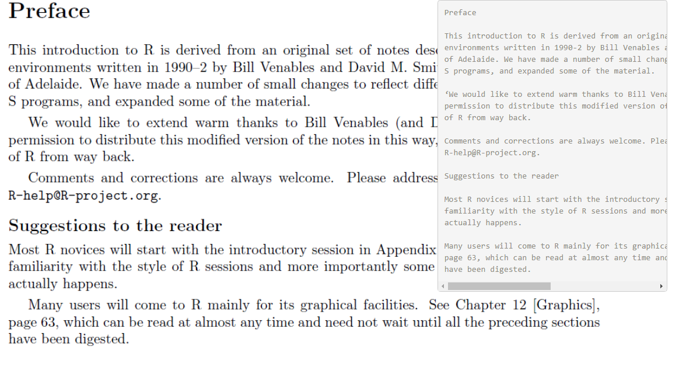

# Textify : Say YES to Text!

# What is the app about?
Textify allows the user to extract text from an image that can be shared across any device and platform.
It is as simple as it sounds!

# Requirements
The app can be accessed from any device that supports a browser and a stable internet connection. 
To see it in action, click [here](https://adityahasurkar.shinyapps.io/Textify/).

# What problem does it solve?
Textify is made for those who like to store image data in their devices and wish to free up some storage space by extracting text from those images and storing it in text format instead. If you're looking for a quick solution that could help do this job without any costs then look no more. 

# License
[MIT](https://choosealicense.com/licenses/mit/)
